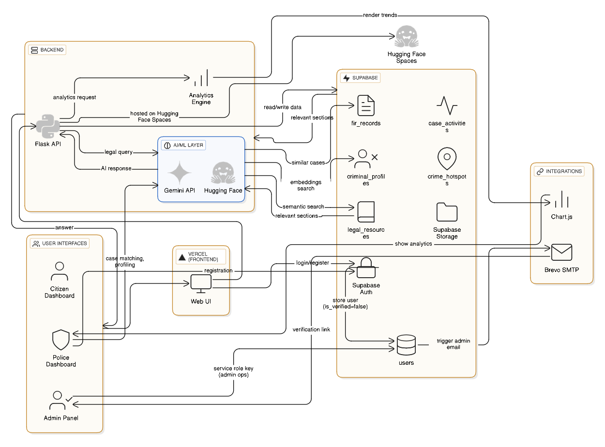

---

# **AI-Powered Legal Assistance System**

### *Automated FIR Drafting • Legal Chatbot • Police Verification • RAG + Gemini AI • Full-Stack System*

<div align="center">
  
  
  
  
  
</div>

---

## 📜 **Project Overview**

The **AI-Powered Legal Assistance System** is an end-to-end web platform designed to assist citizens and police officers with digital FIR drafting, legal query resolution, and workflow automation.
It combines:

* **AI-generated FIR drafts**
* **Hybrid RAG + Gemini 2.5 Flash legal chatbot**
* **Police verification workflow with admin approvals**
* **Email notification system via Brevo SMTP**
* **Secure Supabase database with RLS**
* **Modern dashboards for citizens, police & admin**

The system is fully deployed using **Vercel (Frontend)** and **HuggingFace Spaces (Backend)**.

---

# 🚀 **Key Features**

### 🧑‍⚖️ Citizen Features

* Register & login securely
* Chat with AI legal assistant
* Get FIR drafts generated automatically
* View previous chats & drafts
* Simple and user-friendly interface

### 👮 Police Features

* Register using badge number, rank, and station
* Await admin verification
* Access police dashboard with case analytics
* View citizen FIR drafts & generate AI insights

### 🛡️ Admin Features

* View all police registrations
* Verify or reject police accounts
* View analytics (Chart.js)
* Receive automatic email notifications for every new registration

### 🤖 AI & Backend Features

* Hybrid **RAG + Gemini 2.5 Flash** legal chatbot
* FIR auto-draft generation with structured format
* Automatic email notifications via **Brevo / SMTP**
* Fully modular Flask backend with sub-apps
* HuggingFace-friendly routing

### 🗄️ Database Features (Supabase)

* User management (citizen + police + admin)
* FIR drafts
* Chat logs
* RAG embeddings
* Verified/Unverified police status

---

# 🧩 **System Architecture**

## **High-Level Architecture Diagram**



---

# 🧬 **System Workflows**

## 🧑‍⚖️ **Citizen Workflow**

1. Citizen registers & logs in via Vercel frontend.
2. Frontend connects to Flask API for authentication & dashboard data.
3. Legal queries are processed using **RAG → Gemini fallback**.
4. FIR drafting form is submitted to backend → Gemini generates structured FIR draft.
5. Citizen dashboard displays chatbot responses and FIR output.

---

## 👮 **Police Workflow**

1. Police registers using badge number, rank, and station.
2. System stores the user in Supabase with `is_verified = false`.
3. Admin receives an automated email containing:

   * Officer name
   * Email
   * Badge number
   * Police station
   * Rank
   * Dashboard verification link
4. Admin logs into dashboard and verifies the officer.
5. Police officer gains access to the police dashboard:

   * FIR insights
   * Chat logs
   * Case summaries
   * Analytics

---

## 🛡️ **Admin Workflow**

1. Admin clicks email link → visits dashboard.
2. Enters admin verification code.
3. Views all police accounts.
4. Filters, searches, and verifies any police officer.
5. Verification updates instantly in Supabase.

---

# ⚙️ **Tech Stack**

## **Frontend**

* HTML5, CSS3, JavaScript
* Vercel Deployment
* Chart.js for admin + police analytics
* Responsive UI

## **Backend**

* Python Flask
* Modular micro-app architecture (FIR, Chatbot, Auth)
* HuggingFace Spaces for deployment
* CORS-enabled API routing

## **AI / NLP**

* **Google Gemini 2.5 Flash**
* **Hybrid RAG (embeddings + semantic search)**
* Fallback pipeline for high accuracy

## **Database**

* Supabase (PostgreSQL)
* RLS (Row-Level Security)
* Edge Functions (optional)

## **Authentication & Email**

* Custom auth system (JWT)
* Brevo SMTP API for emails
* Secure police verification flow

---


# 🔌 **API Endpoints Overview**

### **Authentication**

| Method | Endpoint        | Description                |
| ------ | --------------- | -------------------------- |
| POST   | `/api/register` | Register citizen or police |
| POST   | `/api/login`    | Login & return JWT         |

### **Police Verification**

| Method | Endpoint                | Description                      |
| ------ | ----------------------- | -------------------------------- |
| GET    | `/api/get-police-users` | Fetch all police profiles        |
| POST   | `/api/toggle-verify`    | Verify / unverify police officer |

### **Chatbot**

| Method | Endpoint    | Description                            |
| ------ | ----------- | -------------------------------------- |
| POST   | `/api/chat` | Process legal queries via RAG + Gemini |

### **FIR Drafting**

| Method | Endpoint            | Description                        |
| ------ | ------------------- | ---------------------------------- |
| POST   | `/api/generate-fir` | Generate FIR draft from user input |

---

# 🛠️ **Installation (Local)**

### **1️⃣ Clone Repo**

```bash
git clone https://github.com/Satkar1/Legal_Assistant.git
cd Legal_Assistant
```

### **2️⃣ Install Dependencies**

```bash
pip install -r requirements.txt
```

### **3️⃣ Add Environment Variables**

Create `.env` in backend directory:

```
SUPABASE_URL=...
SUPABASE_KEY=...
SUPABASE_SERVICE_ROLE_KEY=...
GEMINI_API_KEY=...
ADMIN_EMAIL=...
EMAIL_USER=...
EMAIL_PASSWORD=...
EMAIL_HOST=smtp.gmail.com
EMAIL_PORT=587
FRONTEND_URL=https://legal-assistant-two.vercel.app
ADMIN_VERIFY_CODE=your_admin_code
JWT_SECRET=your_secret
```

### **4️⃣ Run Backend**

```bash
python app.py
```

### **5️⃣ Open Frontend**

Open `index.html` directly or deploy on Vercel.

---

# 🎯 **Future Enhancements**

* Live deployment for state police portals
* OCR-based complaint-to-FIR conversion
* Role-based dashboards for courts, lawyers, field officers
* WebSocket-based real-time chat

---

# 📝 **Conclusion**

This project demonstrates a fully functional, production-ready system that blends **AI, law, and software engineering** to simplify legal processes.
From FIR drafting to police verification, it modernizes essential workflows using **RAG + Gemini**, Supabase, and a secure full-stack environment.

---

# 🙌 **Contributors**

**Satkar** — Developer & Architect

---

